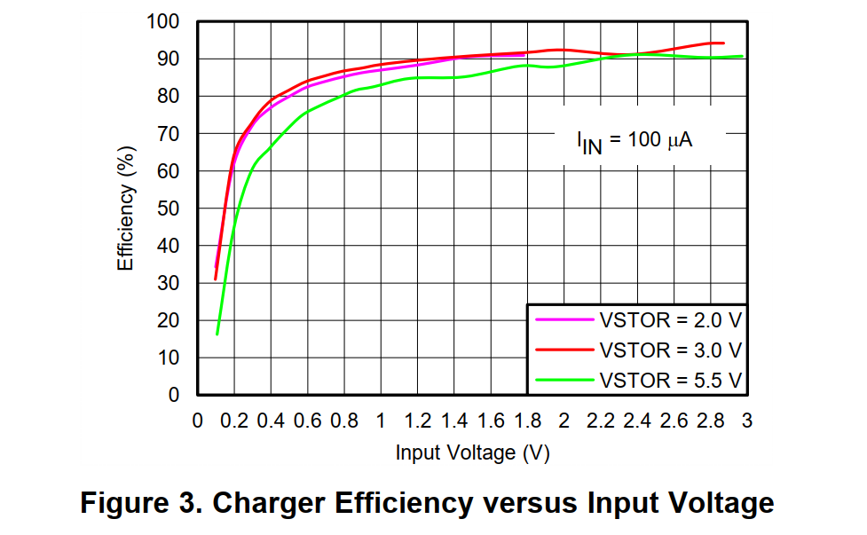
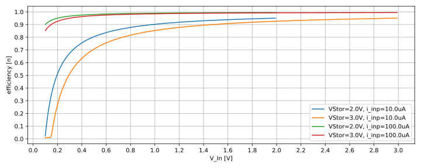
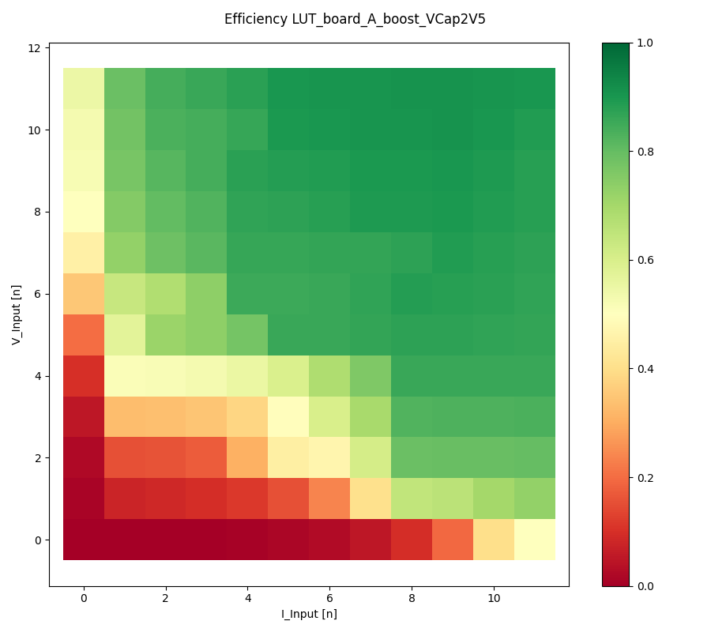
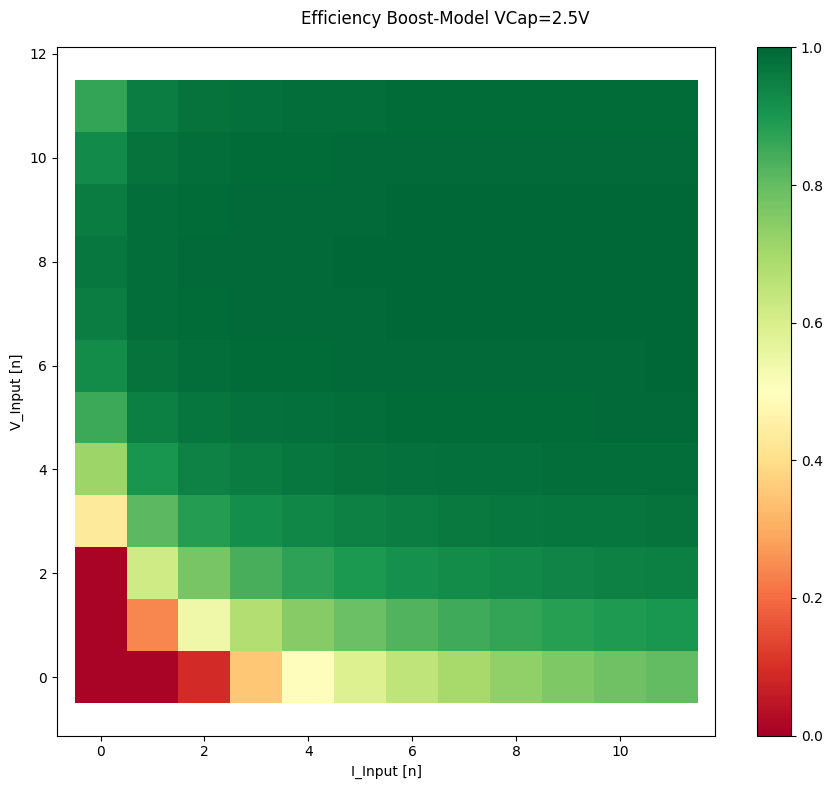

# Crude Efficiency Model

The quest to recreate the efficiency plots of BQ25570s datasheet. 
A boost converter consists of different electronic parts - each has its own characteristic and efficiency.
An idea for an efficiency-model can be achieved by reading:

- https://www.electronicdesign.com/technologies/power/article/21190563/boost-converter-efficiency-through-accurate-calculations
- `slva372d.pdf` - Basic Calculation of a Boost Converter's Power Stage

When looking at `sluuaa7a.pdf` it shows us a figure:

When implementing a basic model and filling the params with values found in the datasheet (or just making an educated guess) we get:

This is not too far off!

## Comparison to measured LUTs

For `V_Stor=2.5V` the measurements give us:

doing the same with the model:

It is similar, but shows major weaknesses. 
Unfortunately that is one of the better plots.
Comparing higher VCap shows even bigger differences.

## What was tried

- adding more parts to the model (most is only more of the same ...)
- automatically estimating parameters to match the measured values
  - this sounded promising, but didn't work as expected

## What might work

- identifying the influence of each parameter and tune it accordingly
- a `real` spice-like simulation?
