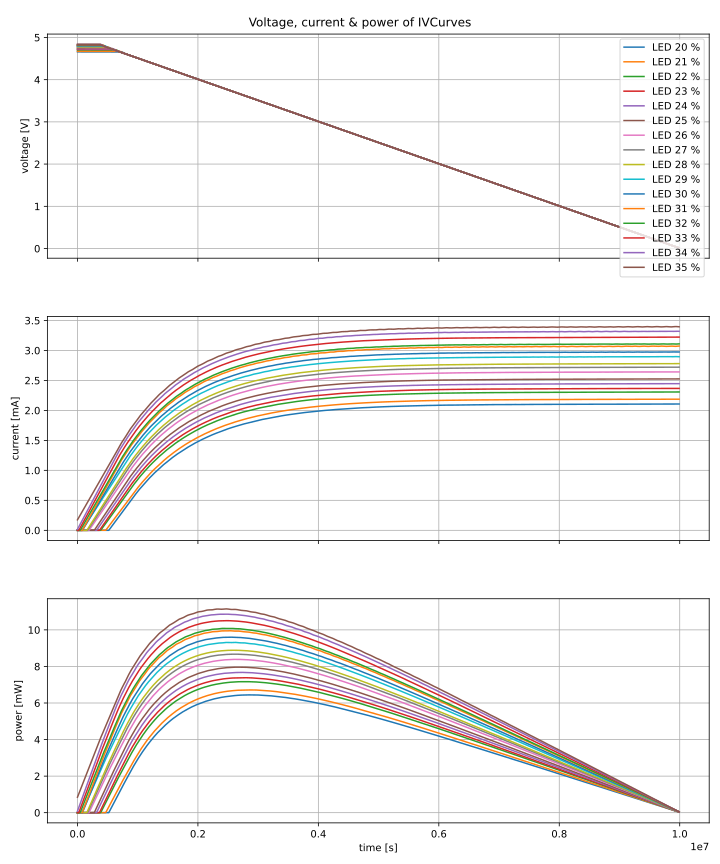
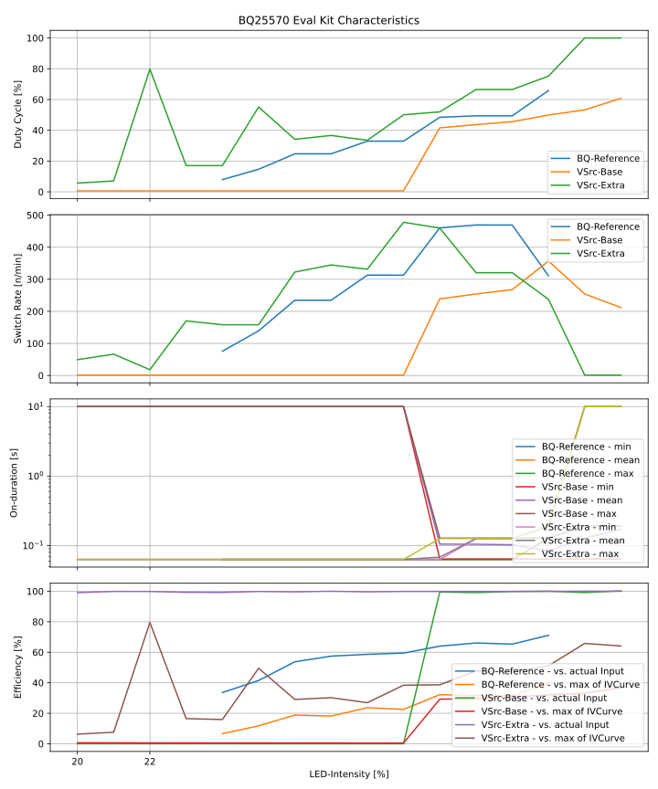

# Characterizing the Diode & Capacitor Harvester

This setup is combining the following parts (from front to back):

- Light-source is still the Elgato Keylight in a lightbox 
  - controllable with integer percent-values
- Solarcell is the [Anysolar SLMD121H9L](https://www.digikey.de/en/products/detail/anysolar-ltd/SLMD121H09L/2754277)
  - VOC-MAX is 5.76 V (at 1 Sun)
  - VOC with 60% keylight is 4.9 V
- Diode is the [Nexperia PMEG10010ELRX](https://www.digikey.de/en/products/detail/nexperia-usa-inc/PMEG10010ELRX/5436248?s=N4IgTCBcDaIAoFkCiBxAjABg5pAZASgBogC6AvkA)
  - a SMU [IV-Sweep can be found here](https://github.com/orgua/shepherd_v2_planning/blob/main/docs/10_capes/media_v23/profiler_smu_hrv_diodes.csv)
  - multimeter says 440 mV
- Eval Kit (modded according to [var3-measurements](https://github.com/orgua/bq_characteristics/tree/main/eval_kit_behavior_var3))
  - only the storage Capacitor and buck-converter are used
  - diode brings energy directly to VBAT
  - BAT-OK-Hysteresis goes from 4.03 to 4.43 V
  - VSTOR and VBAT connected
- switched target
  - BSH105,215 MosFet - switched by BAT_OK
  - 1k Resistor (measured 984 Ohm) -> was not suitable (20% LED = 0% BAT-OK on, 21% LED = 10% BAT-OK on, 22% LED = 100% BAT-OK on)
  - 200 Ohm Resistor -> also not suitable (drains cap too fast and turns off V_OUT)
  - 330 Ohm -> quite OK from 23 to 46 % LED, very fast switching, ripple on VOUT
  - **510 Ohm** -> better, from 23 to 33 % with increasing duty cycle
    - one device says 522 Ohm, the other 508.1

## Measurements

- ivcurves from the solarcell, lightbox and keylight were recorded with shepherd
- diode - cap - bq-buck - behavior was recorded with the logic pro 16

The input looks as followed

## Results

As the vSrc has no feedback for varying the voltage before the diode, the simulation is not matching the measurement from the real system.

While the real system begins to signal bat-OK with 24 % LED, the sim needs 30 %.

The real system has 100 % duty cycle with 34 % LED.

