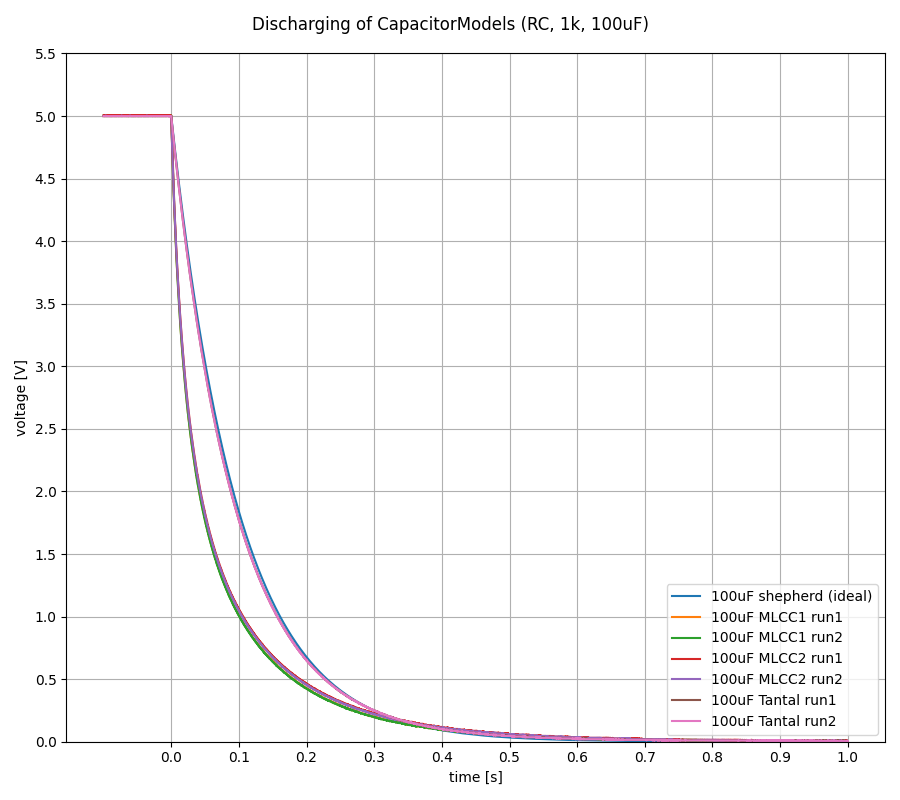
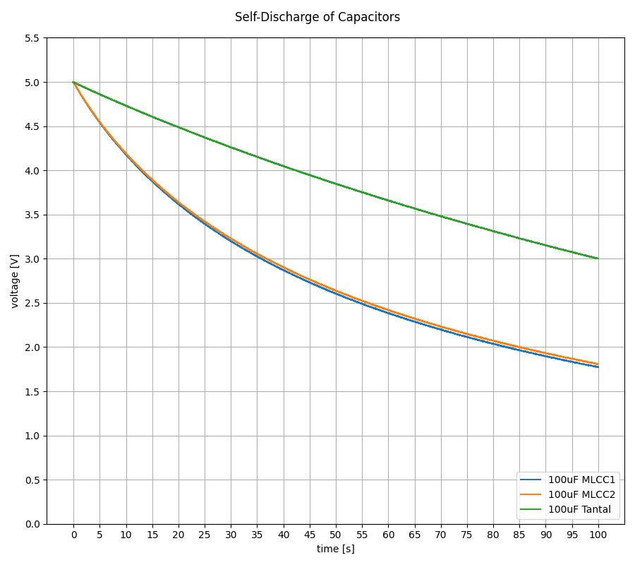
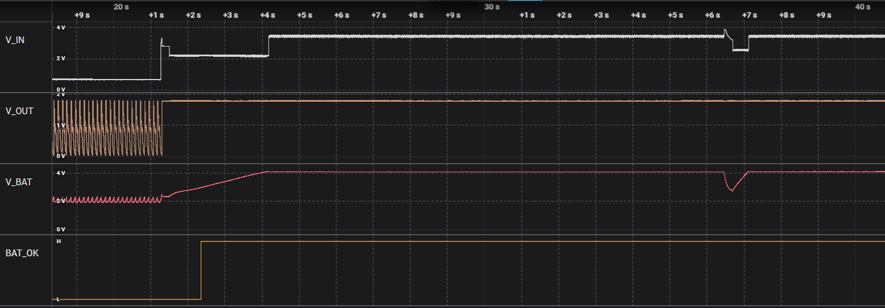
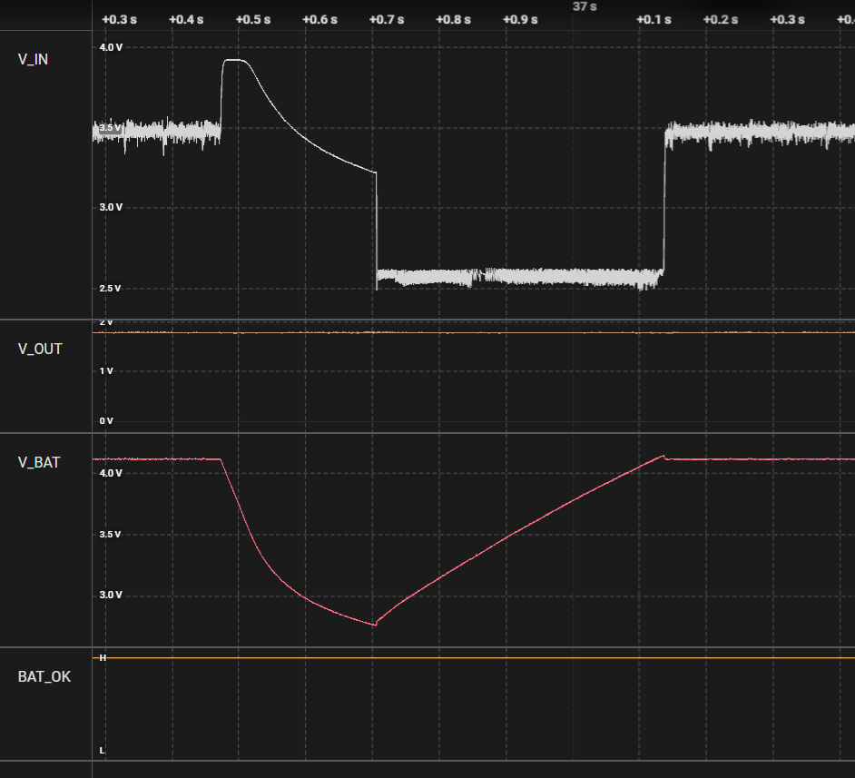
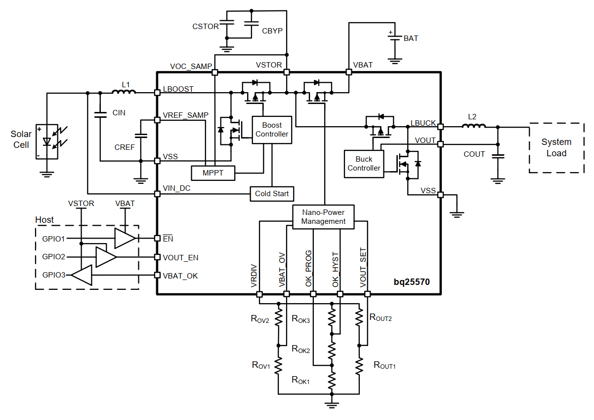
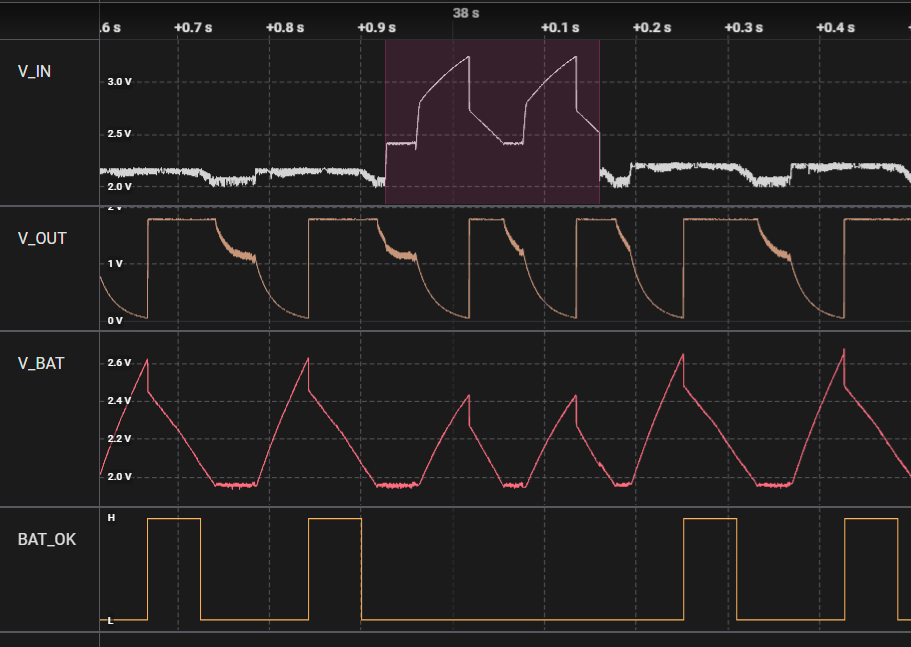
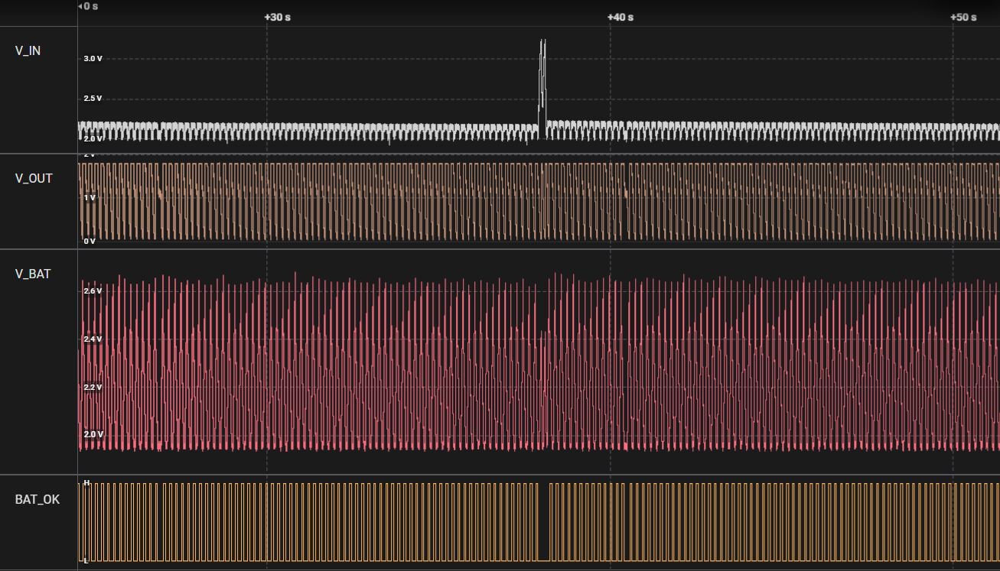

# BQ25570 Characteristics

## Setup

Components described from front to back

- constant current (CC) supply
	- 400 mA, 700 mA, 900 mA, 1100 mA
- LED in wooden light box
	- Cree XM-L
- Solar cells in same box, exposed to the LEDs
	- two KXOB121K04F in series
- BQ25570 with said solar cells as input
	- BQ25570 Eval Kit
- resistive load on output of buck-converter
	- Open Circuit (OC), 1k, 100 ohm

### Analog Parts

R100 = 99.79 Ohm,

R1k = 983.263 Ohm,

C_Stor = 79uF,

## Measurements

- ivcurves of solar cells, recorded with shepherd harvester
- Saleae Logic Pro 16 (2MOhm Impedance) was used to record analog pins of BQ-IC
	- V_IN - output of solar cell, input of BQ
	- V_BAT - voltage over storage capacity on Eval Kit
	- V_Out - output of buck-converter, input of load
- BAT_OK signal was recorded digitally by the logic pro
	- BAT_OK is also enable-signal for buck-converter of BQ
- Capacitor charging / discharge-curve (RC-characteristic)
  - 1k + various capacitors
  - programmable power-source 0V and 5V
  - Logic Pro 16 to record trigger and voltage over capacitor

NOTE: the .sal-files can be opened by the freely available Logic 2 software.
	-> traces can be exported to csv via file -> export raw data

## Experiments

- 400 mA LED, open circuit
	- input is disconnected and rises to VOC @ 3.35 V
	- capacitor is limited to ~ 4.1 V max
	- output is stable at 1.8 V
- 400 mA LED, 1k Ohm
	- open circuit voltage seems to be 2.9 V
	- output gets enabled when cap rises above 2.35 V
	- output is on for ~ 10 ms, every 120 ms
	- output does not turn off completely right away
	- bat-OK is never high
- 700 mA, 1k Ohm
	- output is on for ~ 80 ms, every 175 ms (45%)
	- bat-ok is high for ~ 58 ms
- 900 mA, 1k Ohm
	- output is on for ~ 150 ms, every 233 ms (64%)
	- bat-OK is high for ~ 58 ms
- 1100 mA, 1k Ohm
	- output always on
	- cap survives VOC-measurement
- 400 mA, 100 Ohm, intermittent
	- 43 s -> disconnect resistor
	- 58 s -> reconnect resistor

NOTE: all measurements are started with a disabled LED to show startup-behavior of the IC.

## Results and Conclusions

### Match with Shepherds VSrc

While the VSrc could be configured to loosely match the behavior for 400mA LED-current

And also the saturated 1100mA LED-Current:

The same config does not work for 900mA LED-current

### Capacitor

The storage capacitor influences the behavior of the BQ-IC.
Lower capacitance means higher switching rates and lower on-durations.
Looking at the charge- and discharge-plot a quicker transition is shown which implies the capacitance is lower than the nominal 100 uF.
Comparing the MLCC to a tantal, we see, that the tantal-capacitor is almost behaving like an ideal capacitor.

When looking at the self-discharge the tantal-capacitor shows a much lower discharge.

## Flaws of the setup

Examining the recorded BQ-behavior some weird effects can be spotted.

### VOC of Solar Cell is too high

Looking at `R1k, LED 1100mA.sal`

and the VOC-Measurement in detail

The sudden spike of V_IN to 3.93 V is the beginning of the VOC-measurement (233 ms duration).
The boost-converter is disabled, V_IN is shortly on a plateau, but soon begins to fall, similar to V_BAT falling. Looking closer at these two voltages:

- V_IN begins to fall when V_BAT is ~ 300 mV below V_IN
- V_IN falls from 3.93 to 3.22 V (at the end of the 233 ms time-frame)
- V_BAT falls from 3.65 to 2.75 V during that period
- the voltage difference between V_IN & V_BAT grows from ~ 300 mV to 500 mV
- the BQ takes its VOC-measurement at the end of the 233 ms window and therefore jumps to 80% of 3.22 V = 2.57 V
  - NOTE: the "real" MPPT is ~ 3.0 V (76 % of 3.93 V), derived from the ivcurve
- the MPPT-voltage can only be held for a short period of time until the capacitor on V_BAT is full, after that less current is needed

Looking at the BQ-Schematic:

The path from V_IN to V_BAT includes an inductor and two mosfets.
The 2nd mosfet between V_Stor and V_Bat might be enabled, but the 1st (left) is disabled with a conducting diode in direction of V_BAT.
While the voltage on the input drops, the current from the solar cell rises and therefore the voltage drop over the diode increases.
This could explain the rising voltage difference between V_IN and V_BAT.

### V_Bat over-voltage protection is too low

The same detailed trace from above can also be interpreted differently.
The chosen solar cell would be sampled at MPPT if the maximum V_BAT would be higher.
V_BAT is limited to < 4.2 V on the eval-board to protect a potential LiOn-battery.

As a direct result of the low over-voltage-limit the set-point is too close to the V_Bat under-voltage-protection-limit.
Trace `R1k, LED 700mA.sal` shows that the VOC-measurement has to be interrupted due to V_BAT falling below 2.0 V:

Another side effect of the under-voltage-protection is that V_OUT of 1.8 V can't be maintained.
Every drop below V_BAT < 2.0 V shows a drop in V_OUT, even before the output is completely disconnected.
When disconnected the trace shows the discharge of the 22 uF placed on the output.

NOTE: Typical boost-designs need a certain ratio between V_IN and V_STOR due to duty cycle limitations.
From the perspective of the boost converter a higher V_BAT / STOR would therefore be beneficial.

### V_Out enabled by V_Stor

This setup enables the buck-converter far too early and long.
V_BAT moves between 2.8 V and 1.9 V (under voltage protection).
The usable charge of the capacitor is far too small.

NOTE: having the capacity on V_STOR would be making the setup less complex, as there would be no disconnecting anymore.
The datasheet of the BQ-IC recommends 100 uF on V_BAT.
A solution could be to directly link V_STOR & V_BAT (shorten the mosfet).

## Optimizing the Setup

- lowering the VOC of the solar cell -> one cell, not two in series
- adjust the V_Bat over-voltage limit to ~ 5.25 V (5.5 is the theoretical max)
  - the capacitor is rated for 6.3 V
  - VBAT_OV = 3/2 * VBIAS * (1 + R1/R2), VBIAS = 1.21 V
  - 4.18 V setup: R1 = 7.5 M, R2 = 5.76 M -> EVM-Default
  - 5.00 V setup: change R1 = 10 M -> violates BQ-Req that R1 + R2 < 13 M
  - 5.22 V setup: change R2 = 4 M (preferred, 2x 2M soldered like V?)
- adjust hysteresis of Bat_OK to 4 to 4.5 V
  - default: 2.79 V to 2.99 V for BAT_OK = ON
  - BATOK-PROG = VBIAS * (1 + R7 / R8)
  - BATOK-HYST = VBIAS * (1 + (R6 + R7)/R8)
  - default: R6 = .887 M, R7 = 6.98 M, R8 = 5.36 M
  - 4.03 to 4.38: change R8 = 3 M
  - 4.03 to 4.43: change R6 = 1 M, R8 = 3 M (preferred)
  - 4.03 to 4.83: change R6 = 2 M, R8 = 3 M
- enable output with BAT_OK (enable JP6)
- if possible: directly connect V_STOR = V_BAT (shorten the mosfet)
- voltages to measure (31 kHz sampling rate)
  - V_IN
  - V_STOR
  - V_BAT
  - V_OUT
- Setpoint: on-off-behavior should be present
  - double solar cell @ LED900mA can produce 4mW, so one cell should bring 2 mW
  - 1 kOHms at 1.8 V draw 3.2 mW (most interesting)
  - 100 Ohms at 1.8 V draw 32.4 mW
