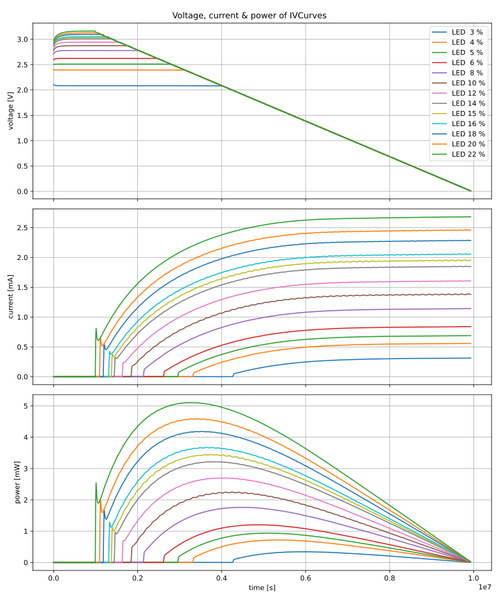
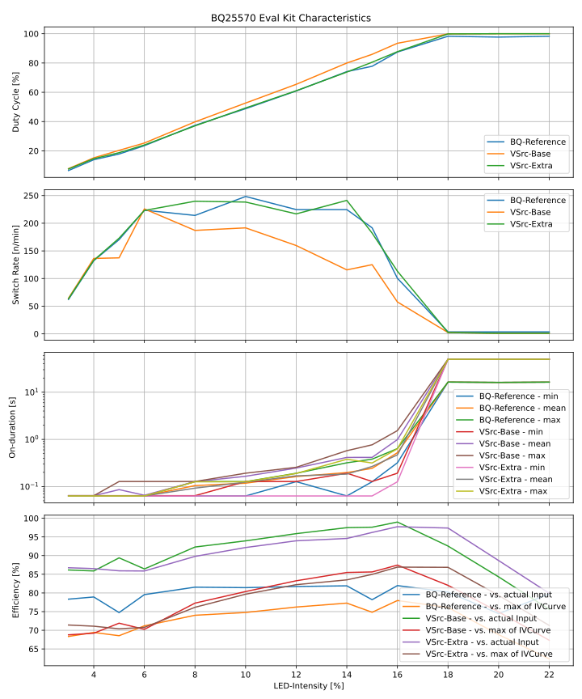

# Characterizing the BQ25570 Eval Kit

With the learnings from [variant 1](../eval_kit_behavior_var1) the process is refined, mostly by modifying the eval board.

## Setup

Components described from front to back

- Elgato Key Light in white Light Box
	- controllable by percent-value
    - run measurement at static intensity
    - first run: 5 %, 10 %, 15 %, 20 %
    - lowest: 3 %
    - second run: 4, 6, 8, 10, 12, 14, 16, 18, 20, 22 %
- Solar cells in same box, exposed to the LEDs
	- model: IXYS SM141K06L
    - https://www.digikey.de/en/products/detail/anysolar-ltd/SM141K06L/9990462
    - VOC-MAX ~ 3.18 V
- BQ25570 with said solar cells as input
	- BQ25570 Eval Kit (Modded as described below), Board B
- resistive load on output of buck-converter
	- Open Circuit (OC), 1k (cherry-picked, spot on)

## Measurements

- ivcurves of solar cells, recorded with shepherd harvester @ different light levels
- Saleae Logic Pro 16 (2MOhm Impedance) was used to record analog pins of BQ-IC
    - 31 kHz sampling rate
	- V_IN - output of solar cell, input of BQ
	- V_BAT - (==V_STOR) voltage over storage capacity on Eval Kit
	- V_Out - output of buck-converter, input of load
- BAT_OK signal was recorded digitally by the logic pro
	- BAT_OK is also enable-signal for buck-converter of BQ
- Capacitor charging / discharge-curve (RC-characteristic)
  - 1k + capacitor from BQ-Board (de-soldered)
  - programmable power-source 0V and 5V
  - Logic Pro 16 to record trigger and voltage over capacitor

# Modifications to the BQ-Eval-Kit

- lowering the VOC of the solar cell -> one cell, not two in series
- adjust the V_Bat over-voltage limit to ~ 5.25 V (5.5 is the theoretical max)
  - the capacitor is rated for 6.3 V
  - VBAT_OV = 3/2 * VBIAS * (1 + R1/R2), VBIAS = 1.21 V
  - 4.18 V setup: R1 = 7.5 M, R2 = 5.76 M -> EVM-Default
  - 5.00 V setup: change R1 = 10 M -> violates BQ-Req that R1 + R2 < 13 M
  - **5.22 V setup: change R2 = 4 M (preferred, 2x 2M)**
- adjust hysteresis of Bat_OK to 4 to 4.5 V
  - default: 2.79 V to 2.99 V for BAT_OK = ON
  - BATOK-PROG = VBIAS * (1 + R7 / R8)
  - BATOK-HYST = VBIAS * (1 + (R6 + R7)/R8)
  - default: R6 = .887 M, R7 = 6.98 M, R8 = 5.36 M
  - 4.03 to 4.38: change R8 = 3 M
  - **4.03 to 4.43: change R6 = 1 M, R8 = 3 M (preferred)**
  - 4.03 to 4.83: change R6 = 2 M, R8 = 3 M (showed some unwanted effects)
- enable output with BAT_OK (enable JP6)
- directly connect V_STOR = V_BAT (bridge the Mosfet)

## Results and Conclusions

The BQ harvested with various LED-intensities. This analysis will look at

- the harvestable energy for the mentioned intensities
- the bq behavior & statistics using that energy
- the characteristics of the storage capacitor on the eval board

### LED & Solar

Shepherds harvester allows us to record an `IVCurve`.
It is basically a voltage ramp and the resulting current at that set-point.
The IVCurve characterizes the light input and the solar cell and allows to later run harvesting-algorithms on that harvesting-setup.
The recorded voltage, current and calculated power for various light intensities are shown here:

### BQ

While the behavior of internal & external states can be plotted during runtime the more meaningful data must be first derived from that.
Analysing `BAT_OK` gives us:

- duty cycle, a percentage for the output being enabled
- switch rate, a mean frequency for the on-and-off switching of the output
- on-duration, statistics over mininmal, mean and maximum duration the output was enabled

Adding the related `IVCurve` and knowledge of the 1k resistive load gives us also needed insight to calculate the efficiency at that set-point

### Comparison of Behavior

3 % Intensity

14 % Intensity

18 % Intensity

### Capacitor

The storage capacitor influences the behavior of the BQ-IC.
Lower capacitance means higher switching rates and lower on-durations.
Looking at the charge- and discharge-plot a quicker transition is shown which implies the capacitance is lower than the nominal 100 uF.

