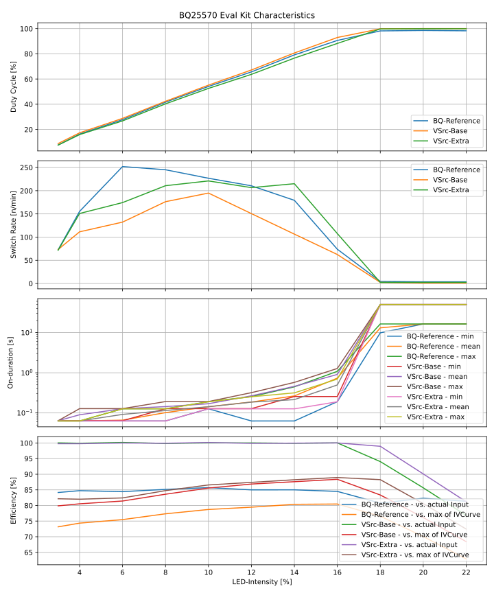

# Characterizing the BQ25570 Eval Kit

Experiment similar to `_Var2`-measurements, but with

- a new switched target
  - BSH105,215 MosFet - switched by BAT_OK
  - 1k Resistor (measured 984 Ohm)
- V_Out is controlled by V_STOR (default, JP3)

Results are similar to `_Var2`, but with a slightly higher efficiency.

### Comparison of Behavior

3 % Intensity

14 % Intensity

18 % Intensity

