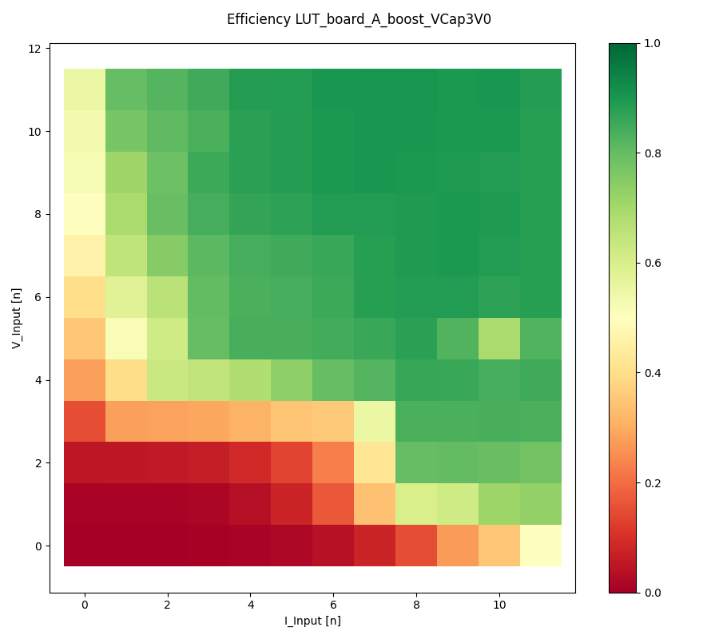
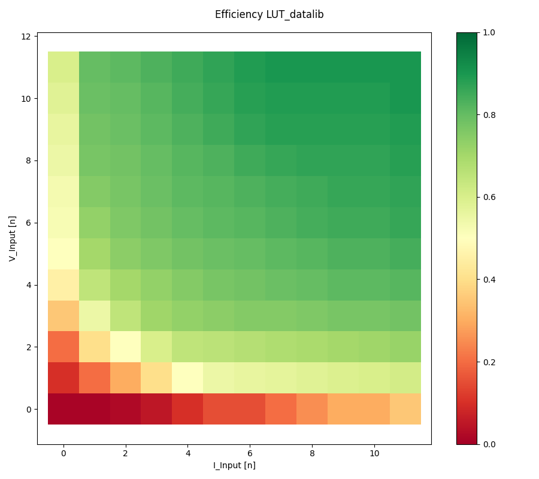
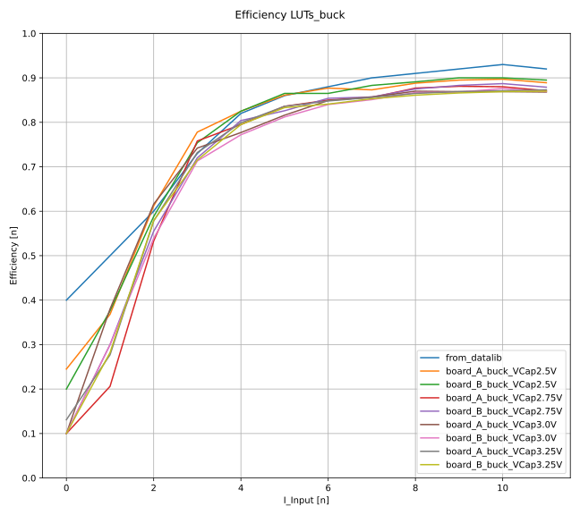

# Efficiency Measurements for the BQ25570 Eval Kit

- Measurements were done in accordance to [sluuaa7a](https://www.ti.com/lit/pdf/sluuaa7).
- The goal was to enhance shepherds precision.
- currently shepherds virtual source used LUTs derived from plots in BQ25570s datasheet
- these LUTs are missing the `V_STOR`-Dimension
  - the boost-LUT is 2D and considers `V_IN` and `I_IN`
  - the buck-LUT is 1D and considers `I_OUT`

## Setup

- two [BQ Eval Kit](https://www.ti.com/tool/BQ25570EVM-206) (without Mods) called A & B
- [Keithley 2604B SMU](https://www.tek.com/de/products/keithley/source-measure-units/2600b-series-sourcemeter)

## Procedure

Measuring the Boost-Converter was challenging, as it changes states only every ~ 16 s, with the VOC-Cycle.
Sometimes the wanted state was not reached because of some violated internal condition.
Running through a 20 x 5 x 25 Grid took almost 24 h.

## Results

- full efficiency matrix for boost- and buck-converter
  - located in `./data_board_X_X_full`
- reduced efficiency matrix for usage in LUTs for shepherds virtual source
  - located in `./data_board_X_boost_LUT`

from there usable LUTs were derived  (see `YAMLs` in `./result_LUTs`)

### Boost-Comparison

### Buck-Comparison

